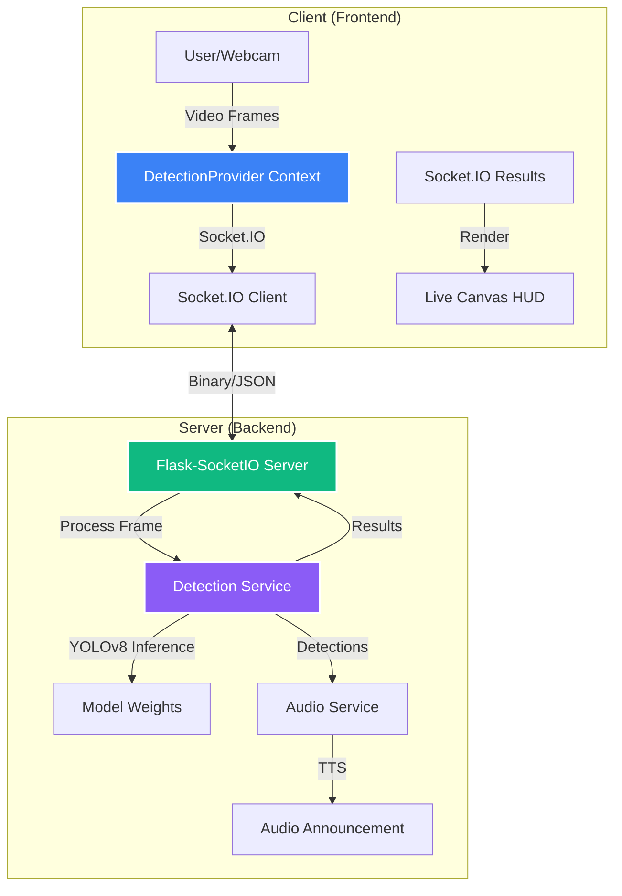

# 👁️ Percevia: AI-Powered Vision Enhancement

**Percevia** is a cutting-edge assistive technology platform designed to empower visually challenged individuals through real-time AI object detection and spatial awareness. By combining modern web technologies with advanced computer vision, Percevia provides an intuitive interface for navigating and understanding the world.

---

## ✨ Features

### 🔍 Real-Time AI Vision
- **YOLOv8 Integration:** State-of-the-art object detection using Ultralytics YOLOv8.
- **Low-Latency Streaming:** Real-time video processing via Socket.IO.
- **Spatial Mapping:** Detects and localizes objects within a 3x3 grid system for precise orientation.

### 🎙️ Multi-Sensory Feedback
- **Audio Announcements:** Real-time vocalization of detected objects using a dedicated TTS engine.
- **Haptic Hints:** (Experimental) Intensity-based feedback for object proximity.

### 👓 Interactive Demo & 3D Visualization
- **Smart Glass Viewer:** High-fidelity 3D model visualization of Percevia hardware.
- **Dynamic UI:** Responsive, dark-themed interface built for performance and accessibility.

---

## 🏗️ System Architecture



---

## 🛠️ Tech Stack


### Frontend
- **Framework:** [Next.js 14](https://nextjs.org/) (App Router)
- **Styling:** [Tailwind CSS](https://tailwindcss.com/)
- **Animations:** [Framer Motion](https://www.framer.com/motion/)
- **3D Rendering:** [React Three Fiber](https://docs.pmnd.rs/react-three-fiber) & [Three.js](https://threejs.org/)
- **Communication:** [Socket.IO Client](https://socket.io/docs/v4/client-api/)

### Backend
- **Server:** [Flask](https://flask.palletsprojects.com/)
- **Real-Time:** [Flask-SocketIO](https://flask-socketio.readthedocs.io/)
- **ML Engine:** [Ultralytics YOLOv8](https://docs.ultralytics.com/)
- **Processing:** [PyTorch](https://pytorch.org/) & [OpenCV](https://opencv.org/)
- **Speech:** [Pyttsx3](https://pyttsx3.readthedocs.io/)

---

## 🏗️ Project Structure

Following **System Design Principles**, the project is split into modular components:

```text
percevia/
├── backend/                # Python ML & Socket Server
│   ├── services/           # Detection & Audio logic
│   ├── weights/            # ML Model weights (YOLOv8)
│   ├── app.py              # Server entry point
│   └── config.py           # Centralized configuration
├── src/                    # Next.js Frontend
│   ├── app/                # App Router pages
│   ├── components/         # UI & 3D components
│   ├── contexts/           # Global state (DetectionProvider)
│   ├── hooks/              # Custom hooks (useDetectionSync)
│   └── lib/                # Utilities & Socket singleton
└── public/                 # Static assets & 3D models
```

---

## 🚀 Getting Started

### 1. Prerequisites
- Node.js 18+
- Python 3.9+
- A webcam (for the demo)

### 2. Backend Setup
```bash
# Navigate to backend (optional, if running locally)
cd backend
# Install Python dependencies
pip install -r ../requirements.txt
# Run the server
python app.py
```

### 3. Frontend Setup
```bash
# Install Node dependencies
npm install --legacy-peer-deps
# Run development server
npm run dev
```
Open [http://localhost:3000](http://localhost:3000) to view the application.

---

## 📜 License
This project is licensed under the **MIT License**.

---

## 🤝 Acknowledgments
- **Ultralytics** for the incredible YOLOv8 models.
- **React Bits** for the stunning UI animation components.
- **Three.js** community for 3D rendering support.
